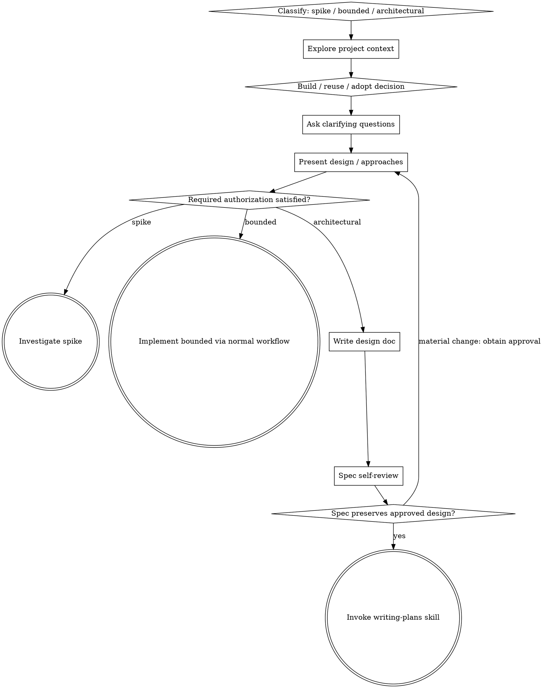

# Brainstorming Ideas Into Designs

Help turn ideas into fully formed designs and specs through natural collaborative dialogue.

Start by classifying how much process the request needs, then work through your path: understand the context, refine the idea, decide what should be reused or adopted versus built, present a design, and get your human partner's approval.

## Authorization Boundary

For an explicit, fully specified, reversible bounded implementation request, the request itself authorizes the described change. State the approach briefly and proceed through affected tests; do not require another approval turn or a new plan/spec document.

Ask before implementation when a material design choice remains unresolved or the work expands scope, authority, security risk, destructive effects, or irreversible external actions. Architectural work still follows design approval below. Approval of an inspection or spike does not authorize keeping or deploying its experimental code.

Product governance is a separate boundary: low-risk exploration and previews should remain default-pass; preserve actual authority and consequential-action requirements.

## Three Paths

Classify the request before choosing the amount of process. Briefly explain the approach when useful; do not add a classification-only turn:

- **Spike** — a feasibility question ("can we...", "is it possible...", "quick and dirty is fine") whose output is an answer, not code you keep. For an explicitly requested safe, read-only probe, state what you will check and proceed; seek approval for consequential experiments. No design doc, no spec file. Report findings as a recommendation; anything you built stays labeled throwaway.
- **Bounded** — a well-scoped change to code that already exists in this repo: a new flag, a small endpoint, a one-file fix. Understanding the kind of app is not enough — bounded means the flow you are changing is already here to read. If there is no existing flow to change, the task is not bounded. Resolve missing information that materially affects the change. Present a short approach in chat and apply the Authorization Boundary above; an already specified, reversible request does not need another yes. No spec file, no implementation plan document.
- **Architectural** — new projects, new subsystems, changes that restructure how components fit together or alter interfaces others depend on. Follow the full process: questions, approaches, sectioned design, written spec, then the writing-plans skill.

Choose the least process justified by observed scope and risk. Reclassify when new evidence changes those facts; pause for approval only when the Authorization Boundary requires it.

## Build vs Reuse vs Adopt Is a Design Decision

For any meaningful capability introduced or materially changed, brainstorming MUST explicitly consider whether to:

1. **Not build it at all** — remove the need through scope reduction or YAGNI.
2. **Reuse existing code in the repository** — prefer an already-correct local implementation over duplication.
3. **Use the language standard library or native platform feature** — prefer built-in capabilities when they satisfy the requirement.
4. **Use an already-installed dependency** — prefer an existing dependency when its current contract fits.
5. **Adopt a new open-source dependency** — consider mature external packages before writing custom infrastructure.
6. **Build custom code** — only when the earlier options do not satisfy the feature's requirements or create worse constraints than they remove.

This is inspired by the Ponytail "stop at the first rung that holds" approach, but Livingware applies it during design rather than waiting until implementation. The goal is not dependency maximization; it is minimizing unnecessary code and maintenance while preserving the feature's MVL, architecture, trust boundaries, and long-term operability.

### Required Dependency Discussion

When an approach introduces a capability that could plausibly be supplied by open source, the design discussion must compare **build vs adopt** before the user approves the approach. Cover the dimensions that materially affect the decision:

- fit to the smallest real user journey / MVL
- existing in-repo capability or overlap
- API/behavioral fit and amount of adapter code required
- maturity, maintenance activity, release stability, and ecosystem adoption
- license compatibility
- security / supply-chain implications
- dependency size and transitive dependency burden
- runtime/platform compatibility
- performance and operational characteristics relevant to the feature
- upgrade/migration cost and lock-in
- whether the package owns a boundary Livingware should keep under local control
- whether adopting it removes more code/complexity than it introduces
- whether a narrow spike is needed to prove the package before committing the architecture

Do not choose "build" merely because custom code is possible. Do not choose "adopt" merely because a package exists.

For important or unfamiliar dependencies, research current package/repository health during brainstorming. Treat package selection as architecture evidence, not an implementation afterthought.

### Dependency Decision Output

The approved design should make the decision visible. Use a concise record such as:

```text
Capability: <what the feature needs>
Decision: reuse | stdlib/native | existing dependency | adopt OSS | custom build
Candidate(s): <package/project or existing module>
Why: <fit to MVL and architecture>
Rejected alternatives: <brief reasons>
Risks/constraints: <license/security/lock-in/runtime/etc.>
Plan prerequisite: install + smoke/contract verification required? yes/no
```

If a new dependency is selected, the later implementation plan must include declaration/pinning, installation, compatibility verification, and a real smoke/contract test before downstream feature code depends on it.

## Approval Is About Scope, Not Ceremony

Small does not mean risk-free: a one-line permission or deletion change can require approval. Conversely, repeating approval for a fully specified, reversible change adds no new decision. Ask about the unresolved choice or expanded risk, not merely whether to continue.

Do not treat approval of a spike as permission to ship it. Compare reuse/native/dependency options before adding meaningful capability; capability to build or the existence of a package does not establish fit.

## Checklist

Use the relevant path as a checklist, not a requirement to generate a todo or artifact for every item.

**Spike:**
1. **Explore project context** — enough to frame the probe
2. **Check reuse/dependency options when the feasibility question depends on them**
3. **Present question + probe plan** — 2-3 sentences
4. **Confirm scope** — use existing authorization for safe read-only investigation; ask for consequential experiments
5. **Investigate** — as cheaply as correctness allows
6. **Report findings** — a recommendation; label anything built as throwaway

**Bounded:**
1. **Explore project context** — check files, docs, recent commits
2. **Check build/reuse/adopt options for any meaningful new capability**
3. **Ask clarifying questions** — one at a time, the ones that matter
4. **Present short design in chat** — approach, dependency decision if relevant, files touched, testing
5. **Apply the Authorization Boundary** — proceed on an explicit, fully specified, reversible request; otherwise obtain the missing design or risk decision
6. **Implement** — proceed with the normal development workflow (TDD applies); no plan document

**Architectural:**
1. **Explore project context** — check files, docs, recent commits
2. **Offer the visual companion just-in-time** — NOT upfront. The first time a question would genuinely be clearer shown than described, offer it then (its own message); on approval its browser tab opens for you. If no visual question ever arises, never offer it. See the Visual Companion section below.
3. **Ask clarifying questions** — one at a time, understand purpose/constraints/success criteria
4. **Evaluate build vs reuse vs open-source adoption for meaningful capabilities** — research candidates where needed and make dependency ownership an explicit design choice
5. **Propose 2-3 approaches** — with trade-offs, dependency strategy, and your recommendation
6. **Present design** — use sections scaled to complexity; obtain approval for the coherent design and unresolved material choices, not a separate yes for every section
7. **Write design doc** — save to `docs/superpowers/specs/YYYY-MM-DD-<topic>-design.md` and commit
8. **Spec self-review** — quick inline check for placeholders, contradictions, ambiguity, scope, and unresolved dependency decisions
9. **Confirm design continuity** — if the written spec changes the approved scope or material decisions, obtain approval for those changes; otherwise reference it and proceed
10. **Transition to implementation** — invoke writing-plans skill to create implementation plan

## Process Flow



**Terminal states are path-bound.** Architectural: the ONLY skill you invoke after brainstorming is writing-plans — never frontend-design, mcp-builder, or any other implementation skill. Bounded: with required authorization satisfied, implementation proceeds directly through the normal development workflow; no plan document. Spike: the terminal state is a reported recommendation.

## The Process

The subsections below serve the bounded and architectural paths (a spike stops at a scoped investigation and recommendation). Sections from **Exploring approaches** onward are architectural-path depth — for bounded work, context plus a few questions plus a short in-chat design is the whole process.

**Understanding the idea:**

- Check out the current project state first (files, docs, recent commits)
- Before asking detailed questions, assess scope: if the request describes multiple independent subsystems, flag this immediately. Don't spend questions refining details of a project that needs to be decomposed first.
- If the project is too large for a single spec, help the user decompose into sub-projects: what are the independent pieces, how do they relate, what order should they be built? Then brainstorm the first sub-project through the normal design flow. Each sub-project gets its own spec → plan → implementation cycle.
- For appropriately-scoped projects, ask questions one at a time to refine the idea
- Prefer multiple choice questions when possible, but open-ended is fine too
- Only one question per message - if a topic needs more exploration, break it into multiple questions
- Focus on understanding: purpose, constraints, success criteria
- Identify meaningful capabilities that could be reused or supplied by existing/open-source dependencies before locking architecture around custom implementations

**Exploring approaches:**

- Propose 2-3 different approaches with trade-offs
- Include the build/reuse/adopt strategy when it materially differs between approaches
- Present options conversationally with your recommendation and reasoning
- Lead with your recommended option and explain why
- YAGNI ruthlessly - remove unnecessary features from every approach and design
- Prefer the earliest rung that fully satisfies the requirement without violating security, accessibility, data-loss protection, governance, or required architectural boundaries

**Presenting the design:**

- Once you believe you understand what you're building, present the design
- Scale each section to its complexity: a few sentences if straightforward, up to 200-300 words if nuanced
- Ask about unresolved material choices; do not require a separate approval for each explanatory section
- Cover: architecture, components, data flow, dependency strategy, error handling, testing
- Make new dependency choices and their verification prerequisites explicit
- Be ready to go back and clarify if something doesn't make sense

**Design for isolation and clarity:**

- Break the system into smaller units that each have one clear purpose, communicate through well-defined interfaces, and can be understood and tested independently
- For each unit, you should be able to answer: what does it do, how do you use it, and what does it depend on?
- Can someone understand what a unit does without reading its internals? Can you change the internals without breaking consumers? If not, the boundaries need work.
- Smaller, well-bounded units are also easier for you to work with - you reason better about code you can hold in context at once, and your edits are more reliable when files are focused. When a file grows large, that's often a signal that it's doing too much.
- Keep locally owned code at boundaries that encode product semantics, authority, governance, or irreversibility even when an open-source package handles lower-level mechanics.

**Working in existing codebases:**

- Explore the current structure before proposing changes. Follow existing patterns.
- Search for existing implementations and installed dependencies before proposing new code or new packages.
- Where existing code has problems that affect the work, include targeted improvements as part of the design.
- Don't propose unrelated refactoring. Stay focused on what serves the current goal.

## After the Design (architectural path)

**Documentation:**

- Write the validated design (spec) to `docs/superpowers/specs/YYYY-MM-DD-<topic>-design.md`
  - (User preferences for spec location override this default)
- Record material build/reuse/adopt decisions and selected dependency candidates in the design
- Use elements-of-style:writing-clearly-and-concisely skill if available
- Commit the design document to git

**Spec Self-Review:**
After writing the spec document, look at it with fresh eyes:

1. **Placeholder scan:** Any "TBD", "TODO", incomplete sections, or vague requirements? Fix them.
2. **Internal consistency:** Do any sections contradict each other? Does the architecture match the feature descriptions?
3. **Scope check:** Is this focused enough for a single implementation plan, or does it need decomposition?
4. **Ambiguity check:** Could any requirement be interpreted two different ways? If so, pick one and make it explicit.
5. **Dependency decision check:** Does every meaningful new capability have a resolved build/reuse/adopt decision? If a new package is chosen, are rationale, constraints, version/pinning intent, and required smoke/contract verification clear enough for writing-plans?

Fix any issues inline. No need to re-review — just fix and move on.

**User Review Gate:**

The written spec must preserve the approved design. Ask for approval when it introduces a material scope, authority, dependency, or design change; otherwise report its location and continue to planning under the existing authorization.

**Implementation:**

- Invoke the writing-plans skill to create a detailed implementation plan
- The plan must carry forward approved dependency decisions and add install + verification prerequisites for any new dependency
- Do NOT invoke any other skill. writing-plans is the next step.

## Visual Companion

A browser-based companion for showing mockups, diagrams, and visual options during brainstorming. Available as a tool — not a mode. Accepting the companion means it's available for questions that benefit from visual treatment; it does NOT mean every question goes through the browser.

**Offering the companion (just-in-time):** Do NOT offer it upfront. Wait until a question would genuinely be clearer shown than told — a real mockup / layout / diagram question, not merely a UI *topic*. The first time that happens, offer it then, as its own message:
> "This next part might be easier if I show you — I can put together mockups, diagrams, and comparisons in a browser tab as we go. It's still new and can be token-intensive. Want me to? I'll open it for you."

**This offer MUST be its own message.** Only the offer — no clarifying question, summary, or other content. Wait for the user's response. If they accept, start the server with `--open` so their browser opens to the first screen automatically. If they decline, continue text-only and don't offer again unless they raise it.

**Per-question decision:** Even after the user accepts, decide FOR EACH QUESTION whether to use the browser or the terminal. The test: **would the user understand this better by seeing it than reading it?**

- **Use the browser** for content that IS visual — mockups, wireframes, layout comparisons, architecture diagrams, side-by-side visual designs
- **Use the terminal** for content that is text — requirements questions, conceptual choices, tradeoff lists, A/B/C/D text options, scope decisions

A question about a UI topic is not automatically a visual question. "What does personality mean in this context?" is a conceptual question — use the terminal. "Which wizard layout works better?" is a visual question — use the browser.

If they agree to the companion, read the detailed guide before proceeding:
`skills/brainstorming/visual-companion.md`
