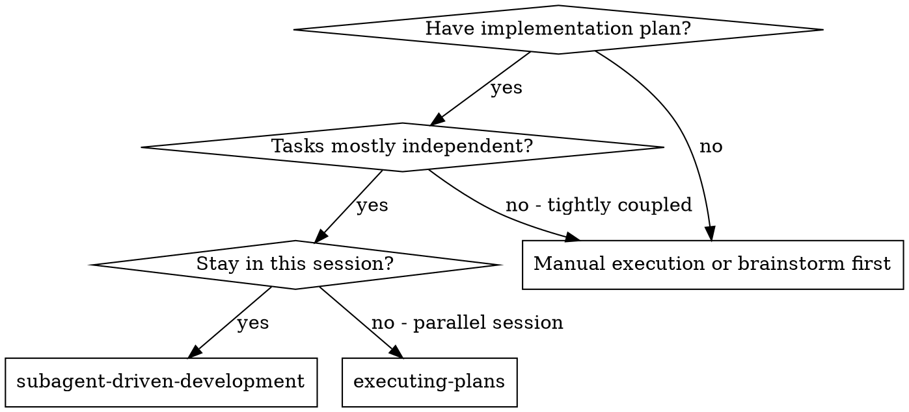

# Subagent-Driven Development

Execute the plan's bounded implementation and review units. `superpowers:writing-plans` owns review cadence: related tasks may share an integrated sprint review, with earlier review for independent risk or repository requirements. A task or small step does not automatically require a new reviewer. `superpowers:requesting-code-review` owns review depth and whether independent context is needed; the plan owns timing. Honor explicit repository/user review requirements.

**Why subagents:** You delegate tasks to specialized agents with isolated context. By precisely crafting their instructions and context, you ensure they stay focused and succeed at their task. They should never inherit your session's context or history — you construct exactly what they need. This also preserves your own context for coordination work.

**Core principle:** Clear ownership + plan-defined review units + scoped fix review + verified integration. In this skill, “task review” means the plan's review unit, which may contain several related tasks.

**Narration:** between tool calls, narrate at most one short line — the
ledger and the tool results carry the record.

**Continuous execution:** Do not pause to check in with your human partner between tasks. Execute all tasks from the plan without stopping. The only reasons to stop are the four named below, or all tasks complete. "Should I continue?" prompts and progress summaries waste their time — they asked you to execute the plan, so execute it.

**Rulings, not stalls.** A running plan does not wait on a human. Conflicts,
ambiguities, plan defects, a cap you would have asked to exceed — decide
them. The spec is the binding authority, the plan is its argument, and your
judgment settles ordinary in-scope implementation ambiguity. Record consequential decisions in the recovery ledger as
`Ruling: <what you decided> — <why> — <what it costs if wrong>`, and keep
going. A wrong ruling costs rework your human partner can see and undo; a
session parked on a question costs their whole day and buys nothing.

Four things stop you, and only these: an irreversible or destructive
operation; a security-sensitive action; a side effect outside this worktree
that norms say you ask about first (a merge, a push to a shared branch, a
publish); and a plan so broken that every path forward is a guess. For those,
stop and ask.

## When to Use



**vs. Executing Plans (parallel session):**
- Same session (no context switch)
- Fresh subagent per task (no context pollution)
- Review each plan-defined unit (spec compliance + code quality); final review covers assembled behavior and remaining cross-unit risks
- Faster iteration (no human-in-loop between tasks)

## The Process

1. Read the plan and recovery state; identify its implementation and review units.
2. Dispatch bounded work with explicit ownership and references to existing requirements.
3. Run focused tests during steps; perform required integration and review at the plan's sprint exit.
4. Resolve findings using concrete evidence; fix actual defects and review only the fix's affected surface.
5. Record completed units, unresolved blockers, and the next action. Proceed only on satisfied dependencies.
6. Verify assembled completion before the authorized branch-finishing action.

Use `superpowers:verification-before-completion` for test-result validity and reuse. Review or message boundaries do not invalidate unchanged evidence.

## Setup

Use superpowers:using-git-worktrees to choose in-place or isolated work from the observed risk and existing authorization.
Never start implementation on a main/master branch without your human
partner's explicit consent.

Use one existing durable tracker for recovery: plan identity, completed-unit commit ranges, unresolved blockers, consequential decisions, fix-loop position, and the next action. After compaction, inspect that tracker and Git before dispatching; never restart accepted work merely because conversation context was lost.

If no suitable recovery location exists for long-running work, `scripts/sdd-workspace PLAN_FILE` can provide a plan-scoped scratch directory. Do not create a second ledger when the plan or existing tracker already carries this state. Leave other plans' state untouched.

**Handoff format:** prefer exact plan/spec sections, commit ranges, and available test output. The brief/report/diff-file helpers below are optional for large handoffs or a harness that needs files; they are not prerequisites for ordinary work. File placeholders in templates may instead identify those existing sources. Retain only state whose loss would cause real rework.

Read the plan once, note its context and Global Constraints, and create a
todo per task. If the plan names a Spec, read that too: the spec is the
authority the plan argues from, and conflicts inside the plan resolve
against it. A plan with no reachable spec gets a ledger note saying so —
rulings made without one are provisional.

Before dispatching the first implementation unit, inspect overlapping files, interfaces, shared constraints, and internal task consistency. Record actual conflicts and consequential decisions in the existing recovery ledger. Do not generate rows for clean comparisons or an exhaustive pairwise preflight table.

Keep recovery state compact: plan identity, completed-unit commit references, current fix position, unresolved findings, consequential rulings, and the next actionable step. It prevents duplicate dispatch after compaction; it is not a second copy of the plan or test output.

## Model Selection

Choose from models actually available in the harness, using task difficulty, required judgment, latency, and total cost. Retain the session model when it is adequate. Use a cheaper model for genuinely mechanical work or a stronger/fresh context when a demonstrated limitation warrants it; neither price nor task title determines the choice alone.

Do not mandate the most capable model for every final review, invent model tiers, or require a model-selection tool the platform lacks. Model-specific mappings belong in platform adapters. Escalate a stuck task only with a concrete change in context, hypothesis, decomposition, or capability.

## The Task Loop

**Batch small same-shape work.** When the plan lists several tasks that are
each a small, independent edit of the same kind — the same one-line fix,
constant change, or field addition repeated across files — do not dispatch
one subagent per task. Compose ONE dispatch brief listing every file and
its change, send the whole batch to a single subagent, and review its diff
as one unit. Use separate dispatches where ownership, risk, or context requires them; honor the plan's integrated review unit.

Everything you paste into a dispatch prompt — and everything a subagent
prints back — stays resident in your context for the rest of the session
and is re-read on every later turn. Reference existing sources; use a file only when it materially reduces a large handoff's context cost.

**Waiting on dispatched subagents:** never poll a wait interface with
short timeouts, and never sit in one silent, open-ended wait either.
While you have local work — ledger updates, packaging the next review,
reading reports — keep working; child results arrive on their own.
When you are genuinely idle, wait in bounded stretches (five to ten
minutes, where your platform allows), and between stretches post one
line of status and reconcile your live children: list them, and chase
any that finished without reporting. A bounded stretch keeps nearly
all of a long wait's efficiency while guaranteeing a stuck or lost
child is noticed within minutes, not at the end of the session.

### 1. Dispatch the implementer

Record BASE (`git rev-parse HEAD`) before dispatching — the review package
and fix-round diffs need it.

- **Requirements:** pass the exact plan/spec section, owned files, current interfaces, and unresolved decisions. Use `scripts/task-brief PLAN_FILE N` only if a separate brief is useful; do not duplicate the same requirements in prompt and file.
- **Result:** return concise status, commit range, affected tests/results, and blockers. A report file is optional when those results are already inspectable in tool output or the existing tracker. Preserve a pointer only when it is needed for recovery.

- A dispatch prompt describes one task, not the session's history. Do not
  paste accumulated prior-task summaries ("state after Tasks 1-3") into
  later dispatches — a real session's dispatch hit 42k chars of which 99%
  was pasted history. A fresh subagent needs its task, the interfaces it
  touches, and the global constraints. Nothing else.
- The dispatch carries the no-subagents contract (it is in the
  implementer template): the implementer never dispatches subagents —
  not helpers, and never a reviewer. Review arrives from you, after the
  report. In real sessions, every reviewer a worker spawned duplicated
  the task review the controller dispatched anyway — a full extra
  review seat per task.
- If an earlier task parked a finding in the area this task touches, carry
  a pointer to that ledger entry in the dispatch.
- Record the implementer's agent identity from the dispatch result —
  fix-loop rounds 1-3 resume this agent.
- Parallel implementation requires authorized delegation, independent ownership, and no shared mutable test/runtime state. Serialize overlapping work; use dispatching-parallel-agents when independent work benefits from concurrency.

Template: [implementer-prompt.md](implementer-prompt.md)

### 2. Handle the report

Implementer subagents report one of four statuses. Handle each appropriately:

**DONE:** Inspect the result and record local implementation progress. If the plan's review unit still has steps remaining, continue those steps without an extra reviewer dispatch. At its review boundary, apply requesting-code-review: ordinary work gets a diff scan, architectural work a structured review, and material judgment risk an independent pass. If dispatching, provide the full recorded review-unit range, never `HEAD~1`; a generated package is optional.

**DONE_WITH_CONCERNS:** The implementer completed the work but flagged doubts. Read the concerns before proceeding. If the concerns are about correctness or scope, address them before review. If they're observations (e.g., "this file is getting large"), note them and proceed to review.

**NEEDS_CONTEXT:** The implementer needs information that wasn't provided. Provide the missing context and re-dispatch.

**BLOCKED:** The implementer cannot complete the task. Assess the blocker:
1. If it's a context problem, provide more context and re-dispatch with the same model
2. If the task requires more reasoning, re-dispatch with a more capable model
3. If the task is too large, break it into smaller pieces
4. If the plan itself is wrong, rule on the correction, ledger it, and re-dispatch with the ruling carried in the dispatch

**Never** ignore an escalation or force the same model to retry without changes. If the implementer said it's stuck, something needs to change.

If the implementer asks questions — before starting or mid-task — answer
clearly and completely, provide additional context if needed, and don't
rush it into implementation.

### 3. Review the task

Reviews are scoped to the plan's review unit, not every implementation step. Honor earlier gates explicitly required by risk or repository policy. At the planned gate, check both spec compliance and quality using the risk-selected review form. Structured self-review may suffice where requesting-code-review permits it; it does not replace an explicitly required independent review. The final review addresses assembled behavior and cross-unit risks rather than replaying unchanged local reviews.

- Give a dispatched reviewer the recorded base/head range and exact requirements. It can read the diff directly; use `scripts/review-package` only when a file materially improves the handoff. Include all commits in the review unit.
- Provide existing result/output references rather than requiring a new report file.

- The global-constraints block you hand the reviewer is its attention
  lens. Copy the binding requirements verbatim from the plan's Global
  Constraints section or the spec: exact values, exact formats, and the
  stated relationships between components ("same layout as X", "matches
  Y"). The reviewer's template already carries the process rules (YAGNI,
  test hygiene, review method) — the constraints block is for what THIS
  project's spec demands.
- Do not add open-ended directives like "check all uses" or "run race tests
  if useful" without a concrete, task-specific reason
- Do not ask a reviewer to re-run tests the implementer already ran on the
  same relevant state — inspect the available result under verification-before-completion
- Do not pre-judge findings for the reviewer — never instruct a reviewer to
  ignore or not flag a specific issue. If you believe a finding would be a
  false positive, let the reviewer raise it and adjudicate it in the review
  loop. If the prompt you are writing contains "do not flag," "don't treat X
  as a defect," "at most Minor," or "the plan chose" — stop: you are
  pre-judging, usually to spare yourself a review loop.
The task reviewer may report "⚠️ Cannot verify from diff" items — requirements
that live in unchanged code or span tasks. These do not block the rest of the
review, but you must resolve each one yourself before marking the task
complete: you hold the plan and cross-task context the reviewer
lacks. If you confirm an item is a real gap, treat it as a failed spec
review — it enters the fix loop with the other findings.

Template: [task-reviewer-prompt.md](task-reviewer-prompt.md)

### 4. The fix loop

The loop triggers when the review reports spec ❌, any Critical or Important
finding, or a ⚠️ item you confirmed as a real gap.

Before the loop starts, two routes leave it immediately:

- Record Minor findings in the progress ledger as you go
  (`Task <N>: minor (deferred): <one-liner>`), and point the final
  whole-branch review at that list so it can triage which must be fixed
  before merge. A roll-up nobody reads is a silent discard. Minor findings
  never enter the loop.
- A finding labeled plan-mandated — or any finding that conflicts with
  what the plan's text requires — is yours to rule on: weigh the finding
  against the plan text, decide with the spec as the binding authority, and
  ledger the ruling before you act on it. Do not dismiss the finding because
  the plan mandates it, and do not dispatch a fix that contradicts the plan
  without a recorded ruling.
At any round, adjudicate a finding when concrete source, contract, or test evidence establishes it is incorrect, already satisfied, or outside required scope. Record the evidence and disposition; disagreement alone does not dismiss a finding. Other actual or unresolved defects enter the repair loop while it produces progress. A fix round is one fix dispatch plus one scoped re-review, with five rounds maximum per review unit:

**Rounds 1-3 — resume the original implementer.** Send it the open findings
verbatim. Its context is intact: it knows the task, the code, and its own
choices. If your harness cannot send another message to a live subagent,
dispatch a fresh implementer carrying the brief path, the report-file path,
and the findings plus the existing recovery/output references.

**Rounds 4-5 — reassess the approach or context** (per Model Selection), with the brief path, the report-file path, the open
findings, and this framing: "A prior implementer attempted this task
[N] times; you own it now. Read the existing recovery record for what was tried." A loop
that survives three resumes usually means the implementer cannot see its
own problem — fresh eyes and a capability bump in one move.

**Every round, either way:** the implementer fixes, re-runs the tests
covering the amended code, and returns the changed scope, commands/results, and unresolved findings once. Before re-dispatching the reviewer, confirm
the available results identify the covering tests, command, and output; dispatch the re-review once all three are present. Name the
covering test files in the fix message — a one-line fix does not need the
whole suite.

**The re-review is scoped.** Use the selected review form with the findings,
existing requirements/results, and the exact fix range from the previously
reviewed head to HEAD. For independent review, use
[re-review-prompt.md](re-review-prompt.md); `scripts/review-package` and new
handoff files are optional. The review verdicts
each finding ADDRESSED or NOT ADDRESSED and flags new breakage in the fix
diff only. New Critical/Important breakage in the fix diff joins the open
findings list. Out-of-scope observations go to the ledger as deferred
minors — they never extend the loop.

**After each round,** append to the ledger:
`Task <N>: fix round <R>/5 (<X> addressed, <Y> open — <finding one-liners>; commits <a7>..<b7>)`

Never fix findings yourself in the controller session — your context stays
clean for coordination, and controller fixes skip review.

**The breaker.** Five rounds is a maximum, not a prerequisite for judgment. If the loop stops producing new information or resolving defects, stop repeating it and reassess earlier.

- **Incorrect, already satisfied, or outside required scope:** close with concrete evidence and a recorded disposition.
- **Real, optional, and not load-bearing:** defer explicitly for final triage.
- **Real and required or load-bearing:** keep the affected task and dependent behavior incomplete. Choose a concrete repair or raise the unresolved design/authority decision. Independent work may continue, but a retry budget cannot turn a failure into acceptance.

### 5. Complete the review unit

Mark the unit complete only when required behavior and planned verification/review gates are satisfied. Record its commit range and any explicitly deferred optional findings. Locally implemented steps awaiting sprint integration are “implemented; integration pending,” not integrated completion.

Do not write a `complete` recovery entry for a unit with unresolved required or load-bearing findings. Preserve those findings and the next action so compaction cannot hide them.

## Final Review

At the final integration boundary, apply requesting-code-review to the assembled change and unresolved cross-unit risks. Reuse valid prior reviews for unchanged surfaces. Do not dispatch another reviewer solely because the branch is ready to merge.

If independent review is required, provide the recorded whole-change range, relevant requirements, risks, and deferred findings. The optional `scripts/review-package` helper can package that range. Select a model by demonstrated need, not a mandatory maximum tier.

If the final whole-branch review returns findings, dispatch ONE fix subagent
with the complete findings list — not one fixer per finding.
Per-finding fixers each rebuild context and re-run suites; a real
session's final-review fix wave cost more than all its tasks combined.
Then run exactly one scoped re-review of the fix wave
(`scripts/review-package PLAN_FILE FIX_BASE HEAD` over the fix range,
[re-review-prompt.md](re-review-prompt.md)).
Adjudicate residual findings using the same evidence rule. A further repair needs a concrete new approach, not another identical review cycle. Unresolved required or load-bearing failures keep integrated completion blocked and must be exposed in the final status; do not pass them into branch finishing as an accepted feature.

## Finish

Report material deviations, unresolved risks, required verification results, and the recovery location concisely. Do not reproduce every routine ledger entry. Preserve recovery state while required work remains.

After assembled behavior and required review/verification gates pass, use `superpowers:finishing-a-development-branch` for the authorized integration action. Cleanup must preserve user-owned files and any record still needed for unresolved work.

## Common Rationalizations

| Excuse | Reality |
|--------|---------|
| "Close enough on spec compliance" | Required gaps remain incomplete until fixed or disproved by evidence; retry exhaustion is not acceptance. |
| "I'll fix it myself, dispatching is overhead" | Controller fixes pollute your context and skip review. Resume the implementer. |
| "One more round will converge" | Past the cap, rounds don't converge — the failure is structural. Adjudicate and route. |
| "The reviewer will just find something new anyway" | Scoped re-reviews verify fixes; they cannot wander. New findings on untouched code go to the ledger, not the loop. |
| "This finding is obviously wrong, I'll drop it" | Adjudicate at any round with concrete evidence and a recorded disposition; never silently discard. |
| "The fix was small, skip the re-review" | Unreviewed fixes are how regressions land. Every round ends with a scoped re-review. |
| "Reviews slow the loop down" | The loop without reviews is just unverified churn. Reviews are the loop's brakes and steering. |
| "Ledger bookkeeping is overhead" | The ledger is what survives compaction. Controllers without one have re-dispatched entire completed task sequences. |
| "The implementer spawned its own reviewer — free extra assurance" | It's a duplicate seat reviewing the same diff; the task review is the gate. A worker-spawned reviewer is a defect to flag, not rigor. |

## Example Workflow

```
You: I'm using Subagent-Driven Development to execute this plan.

[Setup: worktree verified]
[Read plan file once: docs/superpowers/plans/feature-plan.md]
[Resolve workspace: scripts/sdd-workspace docs/superpowers/plans/feature-plan.md — no ledger inside, fresh start]
[Create todos for all tasks]

Task 1: Hook installation script

[Dispatch the first review unit with exact requirements and existing result references]

Implementer: "Before I begin - should the hook be installed at user or system level?"

You: "User level (~/.config/superpowers/hooks/)"

Implementer: [Later]
  - Implemented install-hook command
  - Added tests, 5/5 passing
  - Self-review: Found I missed --force flag, added it
  - Committed

[Run review-package PLAN_FILE BASE HEAD; dispatch task reviewer with the printed path]
Task reviewer: Spec ✅ - all requirements met, nothing extra.
  Strengths: Good test coverage, clean. Issues: None. Task quality: Approved.

[Ledger: Task 1: complete (commits a1b2c3d..d4e5f6a, review clean)]

Task 2: Recovery modes

[Dispatch the next unit with exact requirements and existing result references]

Implementer: [No questions]
  - Added verify/repair modes
  - 8/8 tests passing
  - Committed

[Run review-package PLAN_FILE BASE HEAD; dispatch task reviewer with the printed path]
Task reviewer: Spec ❌:
  - Missing: Progress reporting (spec says "report every 100 items")
  Issues (Important): Magic number (100)

[Fix round 1: resume the implementer with both findings]
Implementer: Added progress reporting, extracted PROGRESS_INTERVAL constant.
  Re-ran test/recovery.test.js — 10/10 passing. Fix report appended.

[Run review-package PLAN_FILE FIX_BASE HEAD; dispatch scoped re-review]
Re-reviewer: Missing progress reporting — ADDRESSED (src/recovery.js:41).
  Magic number — ADDRESSED (src/recovery.js:7). New breakage: none.
  Verdict: all findings addressed.

[Ledger: Task 2: fix round 1/5 (2 addressed, 0 open; commits d4e5f6a..b7c8d9e)]
[Ledger: Task 2: complete (commits d4e5f6a..b7c8d9e, review clean)]

...

[After all tasks]
[Apply risk-based final review; dispatch only if independent review is required]
Final reviewer: All requirements met. Deferred minors triaged: none block merge.

[Keep only recovery state still needed; perform safe cleanup after authorized integration]

Done! Using superpowers:finishing-a-development-branch.
```
