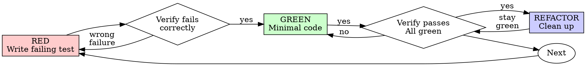

# Test-Driven Development (TDD)

## Overview

Write the test first. Watch it fail. Write minimal code to pass.

**Core principle:** If you didn't watch the test fail, you don't know if it tests the right thing.

**Architectural principle:** Passing local tests does not prove the production components are actually connected. Architectural work also requires real-component integration evidence.

**Frontend principle:** Frontend work is not complete until the changed UI behavior has been exercised in a real browser.

**Violating the letter of the rules is violating the spirit of the rules.**

## When to Use

**Always:**
- New features
- Bug fixes
- Refactoring
- Behavior changes

**Exceptions (ask your human partner):**
- Throwaway prototypes
- Generated code
- Configuration files

Thinking "skip TDD just this once"? Stop. That's rationalization.

## The Iron Law

```
NO PRODUCTION CODE WITHOUT A FAILING TEST FIRST
```

Write code before the test? Delete it. Start over.

**No exceptions:**
- Don't keep it as "reference"
- Don't "adapt" it while writing tests
- Don't look at it
- Delete means delete

Implement fresh from tests. Period.

## Red-Green-Refactor



### RED - Write Failing Test

Write one minimal test showing what should happen.

<Good>
```typescript
test('retries failed operations 3 times', async () => {
  let attempts = 0;
  const operation = () => {
    attempts++;
    if (attempts < 3) throw new Error('fail');
    return 'success';
  };

  const result = await retryOperation(operation);

  expect(result).toBe('success');
  expect(attempts).toBe(3);
});
```
Clear name, tests real behavior, one thing
</Good>

<Bad>
```typescript
test('retry works', async () => {
  const mock = jest.fn()
    .mockRejectedValueOnce(new Error())
    .mockRejectedValueOnce(new Error())
    .mockResolvedValueOnce('success');
  await retryOperation(mock);
  expect(mock).toHaveBeenCalledTimes(3);
});
```
Vague name, tests mock not code
</Bad>

**Requirements:**
- One behavior
- Clear name
- Real code (no mocks unless unavoidable)

### Verify RED - Watch It Fail

**MANDATORY. Never skip.**

```bash
npm test path/to/test.test.ts
```

Confirm:
- Test fails (not errors)
- Failure message is expected
- Fails because feature missing (not typos)

**Test passes?** You're testing existing behavior. Fix test.

**Test errors?** Fix error, re-run until it fails correctly.

### GREEN - Minimal Code

Write simplest code to pass the test.

<Good>
```typescript
async function retryOperation<T>(fn: () => Promise<T>) {
  for (let i = 0; i < 3; i++) {
    try {
      return await fn();
    } catch (e) {
      if (i === 2) throw e;
    }
  }
  throw new Error('unreachable');
}
```
Just enough to pass
</Good>

<Bad>
```typescript
async function retryOperation<T>(
  fn: () => Promise<T>,
  options?: {
    maxRetries?: number;
    backoff?: 'linear' | 'exponential';
    onRetry?: (attempt: number) => void;
  }
) {
  // YAGNI
}
```
Over-engineered
</Bad>

Don't add features, refactor other code, or "improve" beyond the test.

### Verify GREEN - Watch It Pass

**MANDATORY.**

```bash
npm test path/to/test.test.ts
```

Confirm:
- Test passes
- Other tests still pass
- Output pristine (no errors, warnings)

**Test fails?** Fix code, not test.

**Other tests fail?** Fix now.

### REFACTOR - Clean Up

After green only:
- Remove duplication
- Improve names
- Extract helpers

Keep tests green. Don't add behavior.

### Repeat

Next failing test for next feature.

## Integration Gate After TDD

TDD proves local behavior. It does not prove that the implementation uses the real production architecture.

For any change that introduces, modifies, or depends on multiple in-repo production components, run a real-component integration test before claiming completion.

**Mandatory rule:**

```
EVERY CHANGED IN-REPO PRODUCTION COMPONENT
MUST APPEAR REAL IN AT LEAST ONE INTEGRATION PATH
```

The integration path must:
- use real in-repo services, adapters, repositories, evaluators, handlers, and other changed components
- use production wiring, DI, routing, or factories where practical
- use real test persistence when persistence semantics are part of the feature
- substitute only true external or nondeterministic boundaries
- keep the in-repo adapter/client real even when the external remote side is substituted
- be observed failing when the implementation or wiring is incomplete, then passing after the fix

**Not valid integration evidence:**

```text
real route -> MockService -> expected result
```

```text
real DecisionService -> FakeMatcher(return="expected")
```

**Valid integration evidence:**

```text
real route -> real service -> real evaluator -> real repository -> temp SQLite
```

```text
real workflow -> real external-provider adapter -> local HTTP stub for third-party service
```

If a required internal dependency does not exist or is not installed, that is a prerequisite failure. Implement or install it first. Do not mock past the missing dependency and call the design complete.

## Frontend / UI Gate

Any frontend or UI change requires real-browser verification before completion.

**Mandatory rule:**

```
FRONTEND CHANGE -> REAL BROWSER UI TEST -> FAIL THEN PASS
```

Use this gate for changes to pages, routes, components, forms, dialogs, menus, tables, graphs, visualizations, styles that affect behavior/visibility, frontend state, navigation, focus, keyboard/pointer interaction, or frontend/backend wiring.

### Preferred browser connection for WSL development

The normal coding environment is WSL and may intentionally have **no local Chrome installed**. Do not assume a Linux browser is available and do not install one merely to bypass the preferred test path.

Prefer the Windows-host Chrome DevTools endpoint:

```text
http://127.0.0.1:9222
```

Use the Chrome DevTools Protocol / browser automation tooling available in the current harness to attach to that instance and exercise the real running application/session.

Browser priority:

```text
1. Windows-host Chrome reachable from WSL on port 9222
2. project-standard real browser harness, if the project already provides one
3. fresh local browser only if the coding environment actually has one installed
```

### Persistent Chrome is shared state

When attaching to an already-running Chrome, preserve its natural viewport and operator-owned tabs. Use a dedicated fixture-owned page, never mutate the shared viewport/window for a screenshot, and always clean up owned pages, CDP sessions, emulation overrides, and the automation client in `finally`.

If an exact synthetic viewport is required, launch an isolated browser/profile instead. A persistent endpoint is not a disposable test fixture.

When `9222` is reachable from WSL, keep diagnostics and cleanup in WSL/CDP. Do not invoke PowerShell merely because Chrome is Windows-hosted; host launch instructions apply only when the endpoint is unavailable.

Read [remote-cdp-browser-lifecycle.md](remote-cdp-browser-lifecycle.md) before automating a shared browser. It defines the required ownership, natural-viewport, diagnostic, and cleanup contract.

### If `9222` is unavailable: stop and instruct the user

First probe the endpoint:

```bash
curl -fsS http://127.0.0.1:9222/json/version
```

If this fails, **do not silently fall back and do not claim frontend completion**. Treat Windows Chrome availability as a user-provided test prerequisite.

Tell the user to start a separate Windows Chrome debug instance and provide these instructions.

Recommended Windows PowerShell command:

```powershell
Start-Process "$env:ProgramFiles\Google\Chrome\Application\chrome.exe" `
  -ArgumentList '--remote-debugging-port=9222', "--user-data-dir=$env:TEMP\livingware-chrome-debug"
```

If Chrome is installed under the x86 Program Files directory:

```powershell
Start-Process "${env:ProgramFiles(x86)}\Google\Chrome\Application\chrome.exe" `
  -ArgumentList '--remote-debugging-port=9222', "--user-data-dir=$env:TEMP\livingware-chrome-debug"
```

Command Prompt equivalent when `chrome.exe` is available on `PATH`:

```cmd
start chrome --remote-debugging-port=9222 --user-data-dir="%TEMP%\livingware-chrome-debug"
```

Explain that the separate `--user-data-dir` is intentional: modern Chrome does not honor remote-debugging switches against the default Chrome data directory, and the debug profile must remain isolated from the user's normal profile.

Then ask the user to confirm the debug Chrome window is open and retry:

```bash
curl -fsS http://127.0.0.1:9222/json/version
```

If Windows Chrome is open but the WSL process still cannot reach `127.0.0.1:9222`, report a WSL/Windows host-network reachability problem. Do not install Chrome in WSL or substitute a mock browser test as a workaround; resolve reachability first.

The UI test must:
- navigate to the real changed UI path
- render the real frontend bundle and changed in-repo components
- perform the meaningful user interaction when the change is interactive
- use the real backend/integration path when that path is part of the behavior under test
- assert the visible or interactive final result
- check for browser/runtime console errors where practical
- use screenshots/DOM/accessibility state when useful as evidence
- be observed failing when the UI or wiring is incomplete, then passing after implementation

For visual-only changes, inspect the rendered browser result at the natural viewport. Use an isolated browser/profile for exact synthetic viewport coverage. A unit test asserting `className` is not sufficient completion evidence.

For interaction changes, execute the real interaction: click, type, select, drag, keyboard navigation, route transition, graph action, etc.

Read [writing-good-tests.md](writing-good-tests.md) for detailed mock and browser-evidence rules. See [../../docs/testing.md](../../docs/testing.md) for the repository-wide L1/L2/L3 and UI strategy.

## Good Tests

| Quality | Good | Bad |
|---------|------|-----|
| **Minimal** | One thing. "and" in name? Split it. | `test('validates email and domain and whitespace')` |
| **Clear** | Name describes behavior | `test('test1')` |
| **Shows intent** | Demonstrates desired API | Obscures what code should do |

When writing or changing any test, read [writing-good-tests.md](writing-good-tests.md) for the rules that keep tests honest:
- Name the production change that would make the test fail — before writing it
- Assert on real behavior, never on mock behavior
- Keep test-only code in test utilities, out of production classes
- Understand a dependency's side effects before mocking it
- Require real-component integration for architectural completion
- Require real-browser UI evidence for frontend work

## Common Rationalizations

| Excuse | Reality |
|--------|---------|
| "Too simple to test" | Simple code breaks. Test takes 30 seconds. |
| "I'll test after" | Tests written after pass immediately — which proves nothing. |
| "Tests after achieve same goals" | Tests-after answer "what does this do?"; tests-first answer "what should this do?" |
| "Already manually tested" | Manual testing is ad-hoc and not repeatable. |
| "Deleting X hours is wasteful" | Sunk cost fallacy. Keeping code you can't trust is the waste. |
| "Keep as reference, write tests first" | You'll adapt it. That's testing after. Delete means delete. |
| "Need to explore first" | Fine. Throw away exploration, start with TDD. |
| "Test hard = design unclear" | Listen to test. Hard to test = hard to use. |
| "TDD will slow me down" | TDD catches bugs before commit and prevents regressions. |
| "Manual test faster" | Manual doesn't prove edge cases. |
| "Existing code has no tests" | You're improving it. Add tests for existing code. |
| "The mocked integration test passes" | A mocked internal architecture proves only the mock contract, not the implemented design. |
| "Dependency isn't ready, so I'll fake it" | Missing internal dependency is a prerequisite failure, not permission to bypass the architecture. |
| "Component tests pass, so the UI is done" | Component tests do not prove the real browser can render and execute the user path. |
| "Chrome 9222 isn't running" | In WSL, remind the user to start Windows Chrome in debug mode and keep completion blocked until the real browser is reachable. |
| "I'll install Chrome in WSL instead" | Do not replace the designated Windows-host browser prerequisite just to make the gate easier to pass. |

## Red Flags - STOP and Start Over

- Code before test
- Test after implementation
- Test passes immediately
- Can't explain why test failed
- Tests added "later"
- Rationalizing "just this once"
- "I already manually tested it"
- "Tests after achieve the same purpose"
- "It's about spirit not ritual"
- "Keep as reference" or "adapt existing code"
- "Already spent X hours, deleting is wasteful"
- "TDD is dogmatic, I'm being pragmatic"
- Internal architectural components exist only as mocks on the completion path
- Missing production dependency replaced with fake implementation for test convenience
- Frontend change completed without a real-browser interaction/render test
- UI completion evidence consists only of snapshots, jsdom, shallow render, mocked children, or source inspection
- WSL frontend work marked complete while Windows Chrome `9222` remained unavailable

## Example: Bug Fix

**Bug:** Empty email accepted

**RED**
```typescript
test('rejects empty email', async () => {
  const result = await submitForm({ email: '' });
  expect(result.error).toBe('Email required');
});
```

**Verify RED**
```bash
$ npm test
FAIL: expected 'Email required', got undefined
```

**GREEN**
```typescript
function submitForm(data: FormData) {
  if (!data.email?.trim()) {
    return { error: 'Email required' };
  }
  // ...
}
```

**Verify GREEN**
```bash
$ npm test
PASS
```

## Verification Checklist

Before marking work complete:

- [ ] Every new function/method with meaningful behavior has a test
- [ ] Watched each new test fail before implementing
- [ ] Each test failed for the expected reason
- [ ] Wrote minimal code to pass each test
- [ ] All local tests pass
- [ ] Output pristine (no errors, warnings)
- [ ] Tests use real code (mocks only when justified)
- [ ] Edge cases and errors covered
- [ ] Every changed in-repo production component appears real in at least one integration path when the change is architectural
- [ ] No changed in-repo component is mocked on the integration path used as completion evidence
- [ ] Integration test uses production wiring/DI/routing where practical
- [ ] Required external substitutions are explicitly identified and occur at the external boundary
- [ ] Integration test was observed failing on incomplete implementation/wiring and passing after the fix
- [ ] Vertical/E2E coverage exists when the change crosses multiple architectural boundaries or delivers user-visible behavior
- [ ] Any frontend/UI change has real-browser UI test evidence
- [ ] For WSL frontend work, Windows Chrome on `127.0.0.1:9222` was attempted first
- [ ] If `9222` was unavailable, the user was given the Windows debug-mode launch commands
- [ ] Frontend completion remained blocked until a real browser endpoint was reachable and the UI test ran
- [ ] UI test exercised the changed rendered interaction/path and verified the final visible result

Can't check the TDD boxes? You skipped TDD. Start over.

Can't check the integration boxes for architectural work? The implementation is not complete.

Can't check the UI boxes for frontend work? The frontend implementation is not complete.

## When Stuck

| Problem | Solution |
|---------|----------|
| Don't know how to test | Write wished-for API. Write assertion first. Ask your human partner. |
| Test too complicated | Design too complicated. Simplify interface. |
| Must mock everything | Code too coupled. Use dependency injection. |
| Test setup huge | Extract helpers. Still complex? Simplify design. |
| Integration requires unavailable internal dependency | Treat it as prerequisite; install/implement it before completion. |
| WSL cannot reach Chrome `9222` | Remind the user to launch Windows Chrome with the supplied debug command, then retry. Do not install Chrome in WSL or downgrade the UI gate. |

## Debugging Integration

Bug found? Write failing test reproducing it. Follow TDD cycle. Test proves fix and prevents regression.

If the bug occurs at a component boundary, add or strengthen the real-component integration test that reproduces the broken wiring as well.

If the bug is user-visible, reproduce it in the browser test path as well.

Never fix bugs without a test.

## Final Rule

```
Local behavior: production code -> failing test first -> green
Architecture: changed real components -> real integration path -> failing then green
Frontend: changed UI -> Windows Chrome/CDP from WSL -> failing then green
Otherwise -> not complete
```

No exceptions without your human partner's permission.
