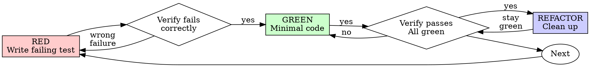

# Test-Driven Development (TDD)

## Overview

For new behavior and bug fixes, establish the failing behavioral test first, then implement the minimum change to pass. For behavior-preserving refactors, establish adequate passing coverage first and keep it green.

**Core principle:** Use an oracle that distinguishes the intended change: a meaningful failure for new behavior or a defect, and adequate before/after coverage for behavior preservation.

**Architectural principle:** Passing local tests does not prove the production components are actually connected. Architectural work also requires real-component integration evidence.

**Frontend principle:** Frontend work is not complete until the changed UI behavior has been exercised in a real browser.

**Violating the letter of the rules is violating the spirit of the rules.**

## When to Use

**Choose the test cycle by the intended change:**

- **New or changed behavior:** failing behavioral test → implementation → green.
- **Bug fix:** defect reproducer or defect-restoring negative control → fix → green. Unrelated passing tests do not prove the defect is fixed.
- **Behavior-preserving refactor:** establish adequate passing characterization/regression coverage → refactor → the same coverage remains green. Reuse existing tests; add characterization only for uncovered behavior. Do not manufacture a failing test or delete valid refactoring merely to create a RED phase.

A refactor preserves observable contracts, including errors, side effects, ordering, and persistence semantics—not just return values. If the change intentionally alters any required behavior, use the new/changed-behavior cycle for that part. Select integration/browser coverage by impact radius in every case.

If a refactor has already been made without a verified baseline, preserve the work and verify the same relevant coverage against the pre-change version and current version in isolation. Until that comparison is available, report preservation as unverified; do not invent a RED result.

**Exceptions (ask your human partner):**
- Throwaway prototypes
- Generated code
- Configuration files

Thinking "skip TDD just this once"? Stop. That's rationalization.

## The Iron Law

```
NO NEW OR CHANGED BEHAVIOR WITHOUT A FAILING BEHAVIORAL TEST FIRST
```

The following RED-first rules apply to new/changed behavior and bug fixes, not behavior-preserving refactors. The refactor path above uses a passing baseline and regression comparison.

Write new behavior before its test? Restart that change from a meaningful failing test. Preserve user-owned and unrelated work.

**No exceptions:**
- Don't keep it as "reference"
- Don't "adapt" it while writing tests
- Don't look at it
- Do not claim RED evidence without observing the intended failure

Implement fresh from tests. Period.

## Red-Green-Refactor



### RED - Write Failing Test

Write one minimal test showing what should happen.

<Good>
```typescript
test('retries failed operations 3 times', async () => {
  let attempts = 0;
  const operation = () => {
    attempts++;
    if (attempts < 3) throw new Error('fail');
    return 'success';
  };

  const result = await retryOperation(operation);

  expect(result).toBe('success');
  expect(attempts).toBe(3);
});
```
Clear name, tests real behavior, one thing
</Good>

<Bad>
```typescript
test('retry works', async () => {
  const mock = jest.fn()
    .mockRejectedValueOnce(new Error())
    .mockRejectedValueOnce(new Error())
    .mockResolvedValueOnce('success');
  await retryOperation(mock);
  expect(mock).toHaveBeenCalledTimes(3);
});
```
Vague name, tests mock not code
</Bad>

**Requirements:**
- One behavior
- Clear name
- Real code (no mocks unless unavoidable)

### Verify RED - Watch It Fail

**MANDATORY. Never skip.**

```bash
npm test path/to/test.test.ts
```

Confirm:
- Test fails (not errors)
- Failure message is expected
- Fails because feature missing (not typos)

**Test passes?** You're testing existing behavior. Fix test.

For a characterization test before a behavior-preserving refactor, passing is expected: verify that it asserts the behavior at risk, then preserve it through the refactor.

**Test errors?** Fix error, re-run until it fails correctly.

### GREEN - Minimal Code

Write simplest code to pass the test.

<Good>
```typescript
async function retryOperation<T>(fn: () => Promise<T>) {
  for (let i = 0; i < 3; i++) {
    try {
      return await fn();
    } catch (e) {
      if (i === 2) throw e;
    }
  }
  throw new Error('unreachable');
}
```
Just enough to pass
</Good>

<Bad>
```typescript
async function retryOperation<T>(
  fn: () => Promise<T>,
  options?: {
    maxRetries?: number;
    backoff?: 'linear' | 'exponential';
    onRetry?: (attempt: number) => void;
  }
) {
  // YAGNI
}
```
Over-engineered
</Bad>

Don't add features, refactor other code, or "improve" beyond the test.

### Verify GREEN - Watch It Pass

**MANDATORY.**

```bash
npm test path/to/test.test.ts
```

Confirm:
- Test passes
- Affected focused regression tests still pass
- Output pristine (no errors, warnings)

**Test fails?** Fix code, not test.

**Other tests fail?** Fix now.

### REFACTOR - Clean Up

After green only:
- Remove duplication
- Improve names
- Extract helpers

Keep tests green. Don't add behavior.

### Repeat

Next failing test for next feature.

## Integration Gate After TDD

TDD proves local behavior. It does not prove that the implementation uses the real production architecture.

For any change that introduces, modifies, or depends on multiple in-repo production components, run a real-component integration test before claiming integrated completion.

**Cadence:** keep the RED-GREEN loop focused on each changed behavior. Group related implementation steps into a coherent sprint and run expensive real-component integration at its exit, rather than after every small step. Run focused seam tests as boundaries change; run broader integration earlier when wiring, persistence, authorization, dependency changes, or uncertainty create a concrete risk. Local task progress is not a claim that the assembled feature is complete.

After a fix, rerun the affected regression tests and invalidated integration checks. Reuse other results only under `superpowers:verification-before-completion`. Existing tests that cover the required behavior need not be duplicated at every layer. Add coverage for actual gaps and preserve a defect-reproducing negative control for new regression tests.

Test output is the default development evidence. Give a concise outcome, commands/results, and remaining gaps; do not generate separate evidence files or intermediate reports unless explicitly required by the user or repository. Product-required runtime records are a separate correctness requirement, not development paperwork.

**Mandatory rule:**

```
FOR ARCHITECTURAL CHANGES, EVERY CHANGED IN-REPO PRODUCTION COMPONENT
MUST APPEAR REAL IN AT LEAST ONE INTEGRATION PATH
```

The integration path must:
- use real in-repo services, adapters, repositories, evaluators, handlers, and other changed components
- use production wiring, DI, routing, or factories where practical
- use real test persistence when persistence semantics are part of the feature
- substitute only true external or nondeterministic boundaries
- keep the in-repo adapter/client real even when the external remote side is substituted
- for new behavior or wiring defects, fail on the missing/broken behavior and pass after the fix; for behavior-preserving refactors, preserve the passing affected integration baseline

**Not valid integration evidence:**

```text
real route -> MockService -> expected result
```

```text
real DecisionService -> FakeMatcher(return="expected")
```

**Valid integration evidence:**

```text
real route -> real service -> real evaluator -> real repository -> temp SQLite
```

```text
real workflow -> real external-provider adapter -> local HTTP stub for third-party service
```

If a required internal dependency does not exist or is not installed, that is a prerequisite failure. Implement or install it first. Do not mock past the missing dependency and call the design complete.

## Frontend / UI Gate

Any frontend or UI change requires real-browser verification before completion.

**Mandatory rule:**

```
FRONTEND CHANGE -> AFFECTED REAL-BROWSER TEST -> SELECTED TEST CYCLE
```

Use this gate for changes to pages, routes, components, forms, dialogs, menus, tables, graphs, visualizations, styles that affect behavior/visibility, frontend state, navigation, focus, keyboard/pointer interaction, or frontend/backend wiring.

### Choose the browser by what the test proves

Do not treat every frontend test as a Chrome test. Follow `AGENTS.md` and select one browser lane by evidence type:

```text
BEHAVIOR  -> Lightpanda     http://127.0.0.1:9223
RENDERING -> Windows Chrome http://127.0.0.1:9222
```

**BEHAVIOR** includes interaction, navigation, frontend state, DOM-visible results, application wiring, and browser-executed JavaScript. Use Lightpanda by default.

**RENDERING** includes visual appearance, layout, paint, fonts, screenshots, canvas/WebGL/WebGPU output, and Chromium-specific rendering behavior. Use Windows-host Chrome.

Run only the affected browser tests unless project instructions require broader coverage. Do not run the same scenario in both engines unless the acceptance criterion actually requires both behavioral and rendering evidence or a browser-specific compatibility question is under investigation.

Read [remote-cdp-browser-lifecycle.md](remote-cdp-browser-lifecycle.md) before browser automation. It defines engine selection, process ownership, shared-Chrome state, viewport, diagnostics, and cleanup.

### Lightpanda behavior lane

Probe the designated endpoint:

```bash
curl -fsS http://127.0.0.1:9223/json/version
```

If it is unavailable and the `lightpanda` binary is installed, start it automatically rather than asking the user to remember the prerequisite:

```bash
lightpanda serve --host 127.0.0.1 --port 9223
```

A harness may background that command, record the PID, wait until `/json/version` responds, and then run the affected behavior tests. If the harness started Lightpanda, stop only that recorded process in unconditional cleanup. If Lightpanda was already running, leave it running. Never kill a process merely by executable name or port.

If the Lightpanda binary itself is unavailable, report the missing behavior-test prerequisite. Do not silently substitute Windows Chrome as a generic behavior fallback.

Lightpanda has no graphical rendering surface, so behavior evidence from it does not prove rendering correctness.

### Windows Chrome rendering lane

Windows-host Chrome at `127.0.0.1:9222` is persistent shared operator state. Use it only when rendering or Chromium-specific evidence is required.

When attaching to an already-running Chrome, preserve its natural viewport and operator-owned tabs. Use a dedicated fixture-owned page, never mutate the shared viewport/window for a screenshot, and always clean up owned pages, CDP sessions, emulation overrides, and the automation client in `finally`.

If an exact synthetic viewport is required, launch an isolated browser/profile instead. A persistent endpoint is not a disposable test fixture.

When `9222` is reachable from WSL, keep diagnostics and cleanup in WSL/CDP. Do not invoke PowerShell merely because Chrome is Windows-hosted.

If a RENDERING test requires Chrome and `9222` is unavailable, tell the user to start a separate Windows Chrome debug instance. Recommended PowerShell command:

```powershell
Start-Process "$env:ProgramFiles\Google\Chrome\Application\chrome.exe" `
  -ArgumentList '--remote-debugging-port=9222', "--user-data-dir=$env:TEMP\livingware-chrome-debug"
```

If Chrome is installed under the x86 Program Files directory:

```powershell
Start-Process "${env:ProgramFiles(x86)}\Google\Chrome\Application\chrome.exe" `
  -ArgumentList '--remote-debugging-port=9222', "--user-data-dir=$env:TEMP\livingware-chrome-debug"
```

Command Prompt equivalent when `chrome.exe` is available on `PATH`:

```cmd
start chrome --remote-debugging-port=9222 --user-data-dir="%TEMP%\livingware-chrome-debug"
```

The separate `--user-data-dir` is intentional: the debug profile must remain isolated from the user's normal Chrome profile.

Chrome availability must not block a BEHAVIOR test that belongs on Lightpanda.

The UI test must:
- navigate to the real changed UI path
- render the real frontend bundle and changed in-repo components
- perform the meaningful user interaction when the change is interactive
- use the real backend/integration path when that path is part of the behavior under test
- assert the visible or interactive final result
- check for browser/runtime console errors where practical
- use screenshots/DOM/accessibility state when useful as evidence
- use fail-then-pass for new UI behavior or wiring defects, and green-before/green-after for behavior-preserving refactors

For visual-only changes, inspect the rendered Chrome result at the natural viewport. Use an isolated browser/profile for exact synthetic viewport coverage. A unit test asserting `className` is not sufficient completion evidence.

For interaction changes that do not depend on rendered pixels, execute the real interaction through Lightpanda: click, type, select, route transition, DOM/state changes, and other supported browser behavior.

Read [writing-good-tests.md](writing-good-tests.md) for detailed mock and browser-evidence rules. See [../../docs/testing.md](../../docs/testing.md) for the repository-wide L1/L2/L3 and UI strategy.

## Good Tests

| Quality | Good | Bad |
|---------|------|-----|
| **Minimal** | One thing. "and" in name? Split it. | `test('validates email and domain and whitespace')` |
| **Clear** | Name describes behavior | `test('test1')` |
| **Shows intent** | Demonstrates desired API | Obscures what code should do |

When writing or changing any test, read [writing-good-tests.md](writing-good-tests.md) for the rules that keep tests honest:
- Name the production change that would make the test fail — before writing it
- Assert on real behavior, never on mock behavior
- Keep test-only code in test utilities, out of production classes
- Understand a dependency's side effects before mocking it
- Require real-component integration for architectural completion
- Require real-browser UI evidence for frontend work

## Common Rationalizations

The RED-first rationalizations below concern new/changed behavior and bug fixes. Passing characterization coverage is the required starting point for a behavior-preserving refactor, not a rationalization.

| Excuse | Reality |
|--------|---------|
| "Too simple to test" | Simple code breaks. Test takes 30 seconds. |
| "I'll test after" | Tests written after pass immediately — which proves nothing. |
| "Tests after achieve same goals" | Tests-after answer "what does this do?"; tests-first answer "what should this do?" |
| "Already manually tested" | Manual testing is ad-hoc and not repeatable. |
| "Deleting X hours is wasteful" | Sunk cost fallacy. Keeping code you can't trust is the waste. |
| "Keep new behavior as reference, write tests first" | Do not call that test-first development; establish the missing-behavior failure before reimplementing. |
| "Need to explore first" | Fine. Throw away exploration, start with TDD. |
| "Test hard = design unclear" | Listen to test. Hard to test = hard to use. |
| "TDD will slow me down" | TDD catches bugs before commit and prevents regressions. |
| "Manual test faster" | Manual doesn't prove edge cases. |
| "Existing code has no tests" | You're improving it. Add tests for existing code. |
| "The mocked integration test passes" | A mocked internal architecture proves only the mock contract, not the implemented design. |
| "Dependency isn't ready, so I'll fake it" | Missing internal dependency is a prerequisite failure, not permission to bypass the architecture. |
| "Component tests pass, so the UI is done" | Component tests do not prove the real browser can render and execute the user path. |
| "Lightpanda 9223 isn't running" | Start the installed Lightpanda CDP server, record ownership, run the behavior test, and stop only the process the test started. |
| "Chrome is already open, so I'll use it for behavior too" | Browser choice follows the evidence type. Do not spend Chrome rendering capacity on ordinary behavior verification. |
| "I'll run both to be safe" | Duplicate browser runs add cost without evidence. Run both only when the acceptance criterion needs both behavior and rendering proof. |

## Red Flags - STOP and Start Over

Apply RED-first flags to new/changed behavior and bug fixes. For behavior-preserving refactors, stop for missing baseline coverage or changed behavior—not merely because a test passes.

- Code before test
- Test after implementation
- Test passes immediately
- Can't explain why test failed
- Tests added "later"
- Rationalizing "just this once"
- "I already manually tested it"
- "Tests after achieve the same purpose"
- "It's about spirit not ritual"
- "Keep as reference" or "adapt existing code"
- "Already spent X hours, deleting is wasteful"
- "TDD is dogmatic, I'm being pragmatic"
- Internal architectural components exist only as mocks on the completion path
- Missing production dependency replaced with fake implementation for test convenience
- Frontend change completed without a real-browser interaction/render test
- UI completion evidence consists only of snapshots, jsdom, shallow render, mocked children, or source inspection
- Behavior-only frontend work routed to Chrome merely because Lightpanda was not already running
- Rendering correctness claimed from Lightpanda behavior evidence
- The same browser scenario run in both engines without an acceptance or compatibility reason

## Example: Bug Fix

**Bug:** Empty email accepted

**RED**
```typescript
test('rejects empty email', async () => {
  const result = await submitForm({ email: '' });
  expect(result.error).toBe('Email required');
});
```

**Verify RED**
```bash
$ npm test
FAIL: expected 'Email required', got undefined
```

**GREEN**
```typescript
function submitForm(data: FormData) {
  if (!data.email?.trim()) {
    return { error: 'Email required' };
  }
  // ...
}
```

**Verify GREEN**
```bash
$ npm test
PASS
```

## Verification Checklist

Before marking work complete:

- [ ] Every new function/method with meaningful behavior has a test
- [ ] New/changed behavior and bug fixes: observed the behavioral test or defect control fail for the intended reason before implementing the fix
- [ ] Behavior-preserving refactors: adequate characterization/regression coverage passes before and after; no unacknowledged observable behavior change
- [ ] Wrote only the code needed for the selected behavior or preservation contract
- [ ] Affected local regression tests pass; required sprint-exit integration checks pass before integrated completion
- [ ] Output pristine (no errors, warnings)
- [ ] Tests use real code (mocks only when justified)
- [ ] Edge cases and errors covered
- [ ] Every changed in-repo production component appears real in at least one integration path when the change is architectural
- [ ] No changed in-repo component is mocked on the integration path used as completion evidence
- [ ] Integration test uses production wiring/DI/routing where practical
- [ ] Required external substitutions are explicitly identified and occur at the external boundary
- [ ] New integration behavior or wiring defects: observed fail then pass; behavior-preserving refactors: affected real integration coverage stays green
- [ ] Vertical/E2E coverage exists when the change crosses multiple architectural boundaries or delivers user-visible behavior
- [ ] Any frontend/UI change has real-browser UI test evidence
- [ ] Browser lane was chosen from the acceptance evidence: Lightpanda for BEHAVIOR, Windows Chrome for RENDERING
- [ ] Lightpanda on `127.0.0.1:9223` was auto-started when a behavior test needed it and the installed service was not already running
- [ ] Only a fixture-owned Lightpanda process was stopped during cleanup
- [ ] Windows Chrome `127.0.0.1:9222` was required only when rendering or Chromium-specific evidence was needed
- [ ] Shared Chrome state was preserved when Chrome was used
- [ ] The same scenario was not run in both browsers without an explicit evidence reason
- [ ] UI test exercised the changed rendered interaction/path and verified the final result appropriate to its evidence type

Can't satisfy the selected test cycle? Report the verification gap and close it before claiming completion. A refactor's green-before/green-after cycle does not require artificial RED evidence.

Can't check the integration boxes for architectural work? The implementation is not complete.

Can't check the UI boxes for frontend work? The frontend implementation is not complete.

## When Stuck

| Problem | Solution |
|---------|----------|
| Don't know how to test | Write wished-for API. Write assertion first. Ask your human partner. |
| Test too complicated | Design too complicated. Simplify interface. |
| Must mock everything | Code too coupled. Use dependency injection. |
| Test setup huge | Extract helpers. Still complex? Simplify design. |
| Integration requires unavailable internal dependency | Treat it as prerequisite; install/implement it before completion. |
| Lightpanda `9223` is not reachable | If the binary is installed, start `lightpanda serve --host 127.0.0.1 --port 9223`, record ownership, wait for CDP, and run the behavior test. |
| Rendering test cannot reach Chrome `9222` | Ask the user to launch the isolated Windows Chrome debug profile, then retry. Do not downgrade rendering evidence to Lightpanda. |

## Debugging Integration

Bug found? Write failing test reproducing it. Follow TDD cycle. Test proves fix and prevents regression.

If the bug occurs at a component boundary, add or strengthen the real-component integration test that reproduces the broken wiring as well.

If the bug is user-visible, reproduce it in the browser test path as well.

Never fix bugs without a test.

## Final Rule

```
New/changed behavior or bug fix: meaningful failing test/control -> implementation -> green
Behavior-preserving refactor: adequate green baseline -> refactor -> same coverage green
Architecture: real components on the affected integration path; use the selected cycle above
Frontend: real browser selected by required evidence lane; use the selected cycle above
Do not run both unless the evidence requires both
Otherwise -> not complete
```

No exceptions without your human partner's permission.
